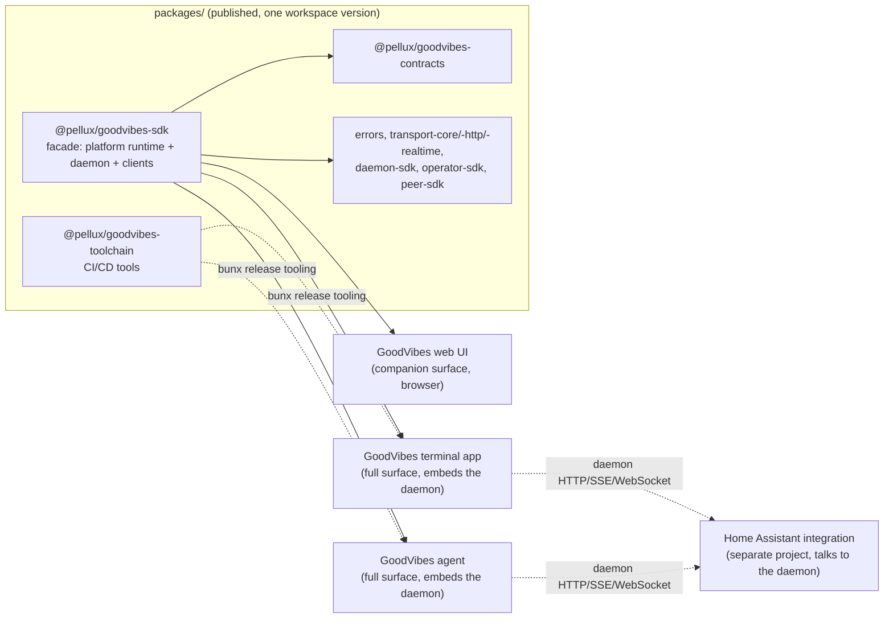

# GoodVibes SDK

[](https://github.com/mgd34msu/goodvibes-sdk/actions/workflows/ci.yml)
[](https://opensource.org/licenses/MIT)
[](https://github.com/mgd34msu/goodvibes-sdk)

GoodVibes SDK is the typed TypeScript platform layer behind the GoodVibes products: sessions, provider/model routing, in-process agents, a knowledge and memory store, a control-plane HTTP and realtime API, and the transports that carry it all. The daemon is its own product, built on this SDK. Full-surface consumers, the GoodVibes terminal app and the GoodVibes agent, embed this runtime directly in a Bun process and connect to the daemon as clients. Companion consumers, the web UI, mobile clients, and the Home Assistant integration, connect to that same daemon as thin remote clients over HTTP, SSE, and WebSocket. One published package covers both: `@pellux/goodvibes-sdk` is a facade over a set of source-of-truth sibling packages, so consumers install one package and import only the entry points they need.

This project is pre-1.0. Public contract, config keys, route paths, event shapes, and file layouts can still change before the 1.0 line. Pin exact versions and read `CHANGELOG.md` before upgrading.



---

## Install

```bash
bun add @pellux/goodvibes-sdk
# or
npm install @pellux/goodvibes-sdk
```

This installs one package; import only the entry points you need. For a Bun host (terminal app, agent, CLI, daemon), the root entry point talks to a reachable GoodVibes daemon:

```ts
import { createGoodVibesSdk } from '@pellux/goodvibes-sdk';
import { createMemoryTokenStore } from '@pellux/goodvibes-sdk/auth';

const sdk = createGoodVibesSdk({
  baseUrl: process.env.GOODVIBES_BASE_URL ?? 'http://127.0.0.1:3421',
  tokenStore: createMemoryTokenStore(process.env.GOODVIBES_TOKEN ?? null),
});

const snapshot = await sdk.operator.control.snapshot();
```

Building a browser or web UI client instead, the companion entry point carries no Bun globals and bundles cleanly with Vite, webpack, and esbuild:

```ts
import { createBrowserGoodVibesSdk } from '@pellux/goodvibes-sdk/browser';
import { createBrowserTokenStore } from '@pellux/goodvibes-sdk/auth';

const sdk = createBrowserGoodVibesSdk({
  baseUrl: 'https://goodvibes.example.com',
  tokenStore: createBrowserTokenStore(),
});

const stop = sdk.realtime.viaSse().agents.on('AGENT_COMPLETED', (event) => {
  console.log('agent completed', event);
});
```

React Native, Expo, and Cloudflare Worker bridges follow the same pattern from their own subpaths. The canonical walkthrough for every runtime is [docs/getting-started.md](./docs/getting-started.md), and runnable versions of each are in [examples/](./examples/README.md).

---

## Package map

| Package | What it is |
| --- | --- |
| [`@pellux/goodvibes-sdk`](./packages/sdk) | The published facade: the full platform runtime (sessions, agents, providers, knowledge, control plane, daemon route handlers) plus thin client factories for Bun, browser, React Native, Expo, and Cloudflare Workers. |
| [`@pellux/goodvibes-toolchain`](./packages/toolchain) | The published CI/CD toolchain: release cut, npm publish, per-job-green verification, coverage and SBOM gates. Invoked as `bunx @pellux/goodvibes-toolchain <tool>` from every GoodVibes repo's release workflow. |
| [`@pellux/goodvibes-contracts`](./packages/contracts) | Runtime-neutral operator and peer contract artifacts, generated method IDs, and lookup helpers that the `sdk` facade and every client surface share. |

`sdk` also draws on further source-of-truth sibling packages: `errors`, `transport-core`, `transport-http`, `transport-realtime`, `daemon-sdk`, `operator-sdk`, `peer-sdk`, and `terminal-shell`. These are public dependencies rather than separate install steps for most consumers. The full package and entry-point matrix is [docs/packages.md](./docs/packages.md).

### Entry points at a glance

| Entry point | Use it for |
| --- | --- |
| `@pellux/goodvibes-sdk` | Full Bun SDK: client factory plus contracts, daemon, auth, operator, peer, and transports |
| `@pellux/goodvibes-sdk/daemon` | Daemon route dispatch and embedding helpers for a Bun server host |
| `@pellux/goodvibes-sdk/browser`, `/web` | Full browser and web UI client factories with the complete operator contract |
| `@pellux/goodvibes-sdk/react-native`, `/expo` | React Native and Expo client factories with mobile secure token stores |
| `@pellux/goodvibes-sdk/workers` | Cloudflare Worker bridge for daemon batch endpoints |
| `@pellux/goodvibes-sdk/contracts` | Runtime-neutral contract types, schemas, and method IDs |
| `@pellux/goodvibes-sdk/auth` | Token stores, login, and OAuth helpers, shared by every surface |

This is a starting point, not the full list. There is no root `@pellux/goodvibes-sdk/platform` entry and no `platform/*` wildcard export. The canonical, stability-leveled reference for every entry point is [docs/public-surface.md](./docs/public-surface.md).

---

## Key concepts

- **Two runtime surfaces.** Full (Bun: TUI, agent, daemon hosts) vs. companion (browser, React Native, Expo, Workers). See [docs/getting-started.md](./docs/getting-started.md) and [docs/surfaces.md](./docs/surfaces.md).
- **Public entry points.** The single canonical, stability-leveled list of every importable subpath: [docs/public-surface.md](./docs/public-surface.md).
- **Contracts.** The typed vocabulary (method IDs, endpoint IDs, event maps) every client and the daemon share: [docs/packages.md](./docs/packages.md).
- **Authentication.** Login, bearer tokens, and platform-specific secure token stores: [docs/authentication.md](./docs/authentication.md).
- **Realtime transports.** SSE and WebSocket with reconnect and typed, session-filtered event domains: [docs/realtime-and-telemetry.md](./docs/realtime-and-telemetry.md).
- **Knowledge and memory.** The SQLite-backed knowledge/wiki system, ingestion, retrieval, and project planning artifacts: [docs/knowledge.md](./docs/knowledge.md).
- **Provider and model runtime.** Daemon-side routing, failover, and catalogs across model providers: [docs/providers.md](./docs/providers.md).
- **Errors.** A typed `SDKErrorKind` model. Match on `err.kind`, never on `err.message`: [docs/error-kinds.md](./docs/error-kinds.md).

Full index: [docs/README.md](./docs/README.md).

---

## Development

```bash
git clone https://github.com/mgd34msu/goodvibes-sdk.git
cd goodvibes-sdk
bun install
bun run build
```

| Command | Does |
| --- | --- |
| `bun run build` | Build every workspace package's `dist/` output once |
| `bun run test` | Run the full Bun test suite (`test/`, mirroring the package sources) |
| `bun run validate` | The portable version of everything CI's `validate` job runs: doc/contract/version/changelog gates, TypeScript build, type-level checks, the API-surface check, examples typecheck, browser-compat, package metadata, `publint`, and the bundle-budget check |
| `bun run api:extract` / `bun run api:check` | Regenerate / verify the API Extractor reports under `etc/*.api.md` |
| `bun run refresh:contracts` | Regenerate contract JSON artifacts and their generated docs after a contract change |

CI (`.github/workflows/ci.yml`) runs `validate`, a dependency and secret-scan audit, a single `build` that every downstream job restores rather than rebuilding, a `platform-matrix` job (Bun tests plus companion-bundle and Workers runtime legs), an exports-resolution check, `publint`, and an SBOM check. Full gate reference: [docs/testing-and-validation.md](./docs/testing-and-validation.md).

---

## Release and stability

Package versions are aligned across the whole workspace, and every version is published together. What counts as a major, minor, or patch change, down to specific export and error-kind rules, is fixed by [docs/semver-policy.md](./docs/semver-policy.md). A misclassified bump is a release gate failure. Releases follow a by-reference flow: a commit is validated exactly once on its push-CI run, a local cut bumps versions and tags without re-running gates, and the tag push re-verifies that the tagged commit's CI run was green before publishing with provenance. Full flow: [docs/release-and-publishing.md](./docs/release-and-publishing.md).

## Security

Security fixes land in the latest published pre-1.0 line; earlier minor lines are not patched. The published package carries source-level overrides for reviewed transitive dependencies, including a patched Bash LSP dependency graph. Bash LSP itself stays bundled because shell language support is part of the SDK feature set. Report a vulnerability and read the current dependency posture in [SECURITY.md](./SECURITY.md) and [docs/security.md](./docs/security.md).

## License

MIT. See [LICENSE](./LICENSE).
